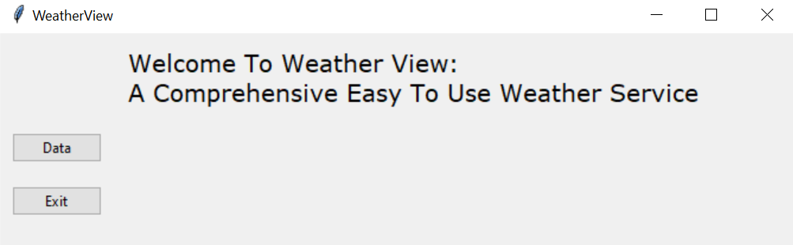
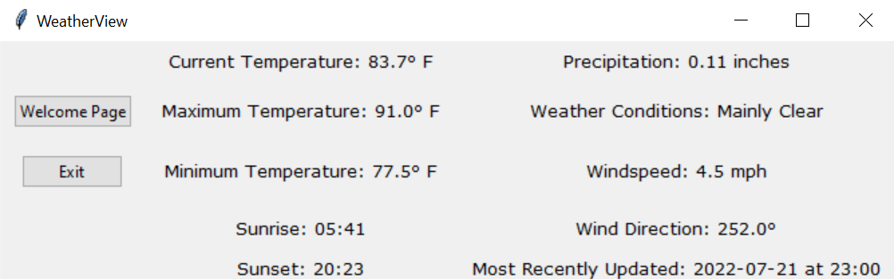
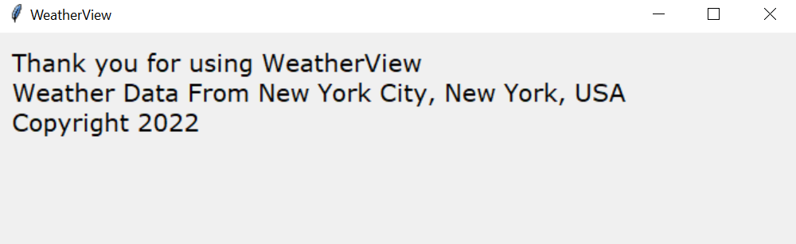

<h1 align="center">
   
 
   
  Markdownify
   
</h1>

<h4 align="center">A Comprehensive Easy To Use Weather Service Application

  <a href="#key-features">Key Features</a> •
  <a href="#how-to-use">How To Use</a> •
  <a href="#credits">Credits</a> •
  <a href="#license">License</a>

## Key Features

* Real time temperature, wind, and cloud cover information
* Daily maximum and minimum tempature statistics
* Sunrise and sunset times
* Daily precipitation information 

## How To Use

Simply download the code into your favorite command line editor and run using Python. Very easy and simple to use!

## Credits

This software uses the following open source packages:

- [tKinter](https://docs.python.org/3/library/tkinter.html)
- [requests](https://pypi.org/project/requests/)
- [Open-Meteo](https://open-meteo.com/en)

## License

MIT
